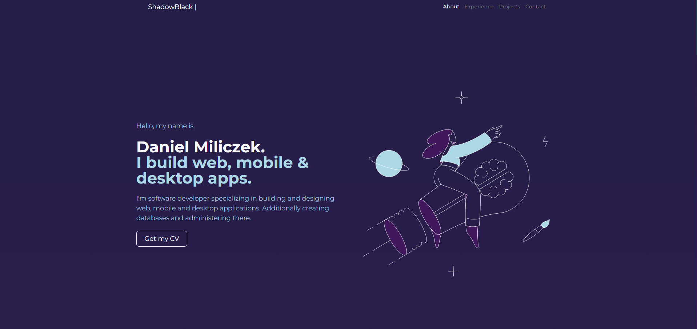
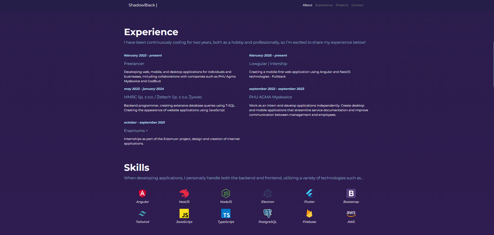
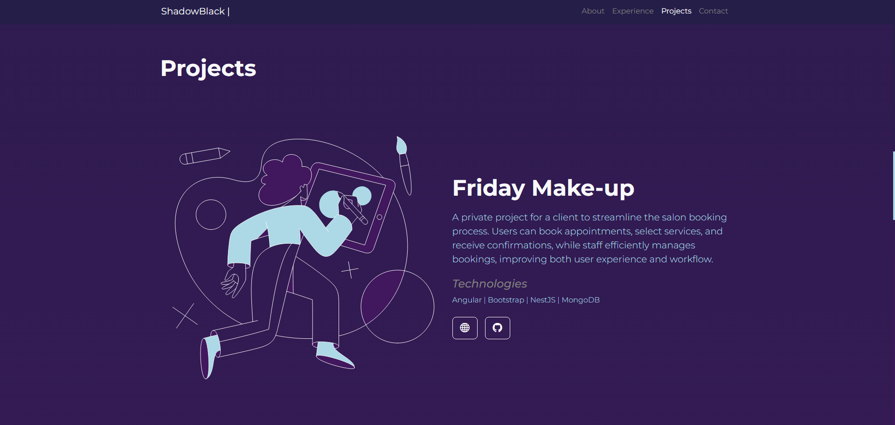

# 💻 PortfolioAngular

Responsive portfolio created with Angular and Bootstrap. Contains information about my skills, experience, projects and the possibility of contacting me.

## 🛠️ Technologie

- Angular 18
- TypeScript
- Bootstrap 5
- Netlify (hosting)

## 🎯 Funkcjonalności

- ✅ Home page with my profile
- ✅ List of projects with description and links to GitHub
- ✅ "Skills" section in the form of icons and a short description
- ✅ Responsive design

## 📸 Zrzuty ekranu





## 🚀 Uruchamianie lokalnie

```bash
gh repo clone ShadowBlack77/portfolio
npm install
ng serve
